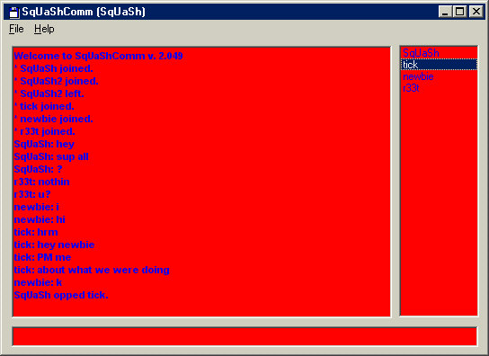

## SqUaSh Comm \- advanced multi user chat room

### Description

Simply the most advanced chat program made in vb yet that I've seen on PSS. TONS of options, private messages, user modes, unlimited users, etc. Tell me what you think.
 
### More Info
 

             |
---                |---
**Submitted On**   |2000-10-21 10:49:08
**By**             |[Daniel Errante](https://github.com/Planet-Source-Code/PSCIndex/blob/master/ByAuthor/daniel-errante.md)
**Level**          |Advanced
**User Rating**    |3.8 (15 globes from 4 users)
**Compatibility**  |VB 5\.0, VB 6\.0
**Category**       |[Internet/ HTML](https://github.com/Planet-Source-Code/PSCIndex/blob/master/ByCategory/internet-html__1-34.md)
**World**          |[Visual Basic](https://github.com/Planet-Source-Code/PSCIndex/blob/master/ByWorld/visual-basic.md)
**Archive File**   |[CODE\_UPLOAD1085010212000\.zip](https://github.com/Planet-Source-Code/daniel-errante-squash-comm-advanced-multi-user-chat-room__1-12198/archive/master.zip)

